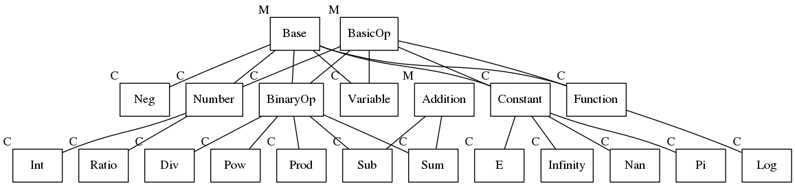

[](https://travis-ci.com/max-codeware/SymDesc)
[](https://codeclimate.com/github/max-codeware/SymDesc/maintainability)

# SymDesc
## A minimal computer algebra system for symbolic manipulation in Ruby
___
The aim of this project is to provide a simple and easy-to-use computer algebra system for symbolic
manipulation.

It represents math expressions through a binary tree and it provides an automatic basic simplification. 
Furthermore, it is possible to perform derivatives and expression evaluation.

The project is still in an early stage, but it is usable and provides several opportunities.

## Installation
---
## Structure of the internal representation:

Modules are marked as `M`, while classes are marked as `C`
---
## CAS settings
This library provides
---
## Provided interfaces
SymDesc provides different interfaces to provide a more comfortable way to write math expressions.\
The two main functions are `var` and `cas`. Both accept an arbitrary number of arguments, and they return a
single result if only argument is provided, or an array if arguments are more than one.\
`var` converts strings or ruby symbols into symbolic variables:
```ruby
  x = var :x   # It creates a single variable named 'x'

  x, y, z = var :x, :y, :z # It creates three variables simultaneously
```

`cas` converts symbols or other objects to symbolic representations, as long as they implement a `to_symdesc`
method.\
Example:
```ruby
  n1, n2 = cas 11, 2.33  #=> 11, 233/100

  class MyClass < String 
  	def initialize(name)
  		super
  	end

  	def to_symdesc
       var self
  	end
  end

  myvar = MyClass.new "v1"
  r1    = cas myvar #=> v1:SymDesc::Variable  
```

### Creating expressions dynamically
An experimental feature has been introduced to allow expression creation without declaring symbols manually.
It is accessible throug a call to `dynamic` and passing a block of code containing the expression. Here an
example:
```ruby
  my_exp = dynamic { x ** 2 + y * z ** 3} #=> x ** 2 + y * z ** 3
```
The above code is the same as:
```ruby
  x, y, z = var :x, :y, :z 

  my_exp = x ** 2 + y * z ** 3
```
